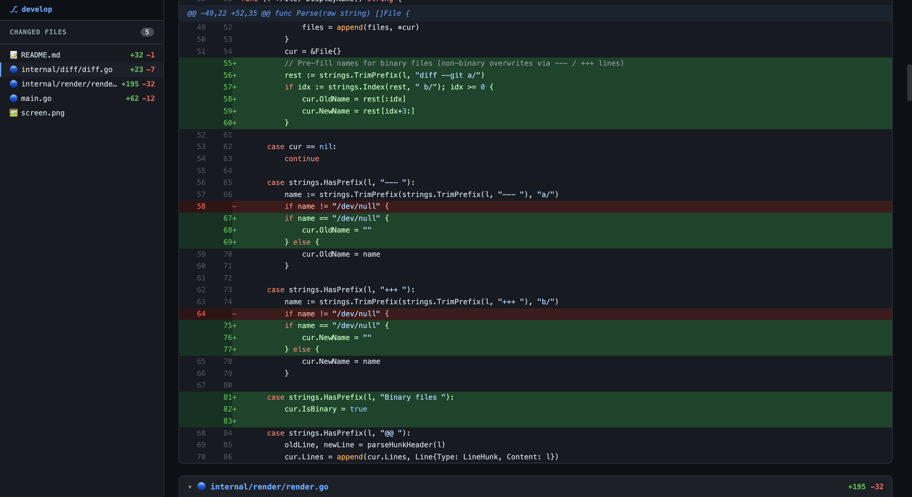

# bak

A local git diff viewer that opens a GitHub-style UI in the browser.



## Install

```sh
go install github.com/yasaricli/bak@latest
```

Requires Go 1.21+ and `git` in your PATH.

## Usage

```sh
bak              # working tree (unstaged changes)
bak --staged     # staged changes
bak HEAD         # last commit
bak HEAD~2       # two commits ago
bak HEAD~3..HEAD # range between commits
```

## Development

**Prerequisites:** Go 1.21+ and `git` in your PATH.

Clone and build locally:

```sh
git clone https://github.com/yasaricli/bak.git
cd bak
go build -o bak .
./bak              # run from the project directory
```

Run without building:

```sh
go run . --staged
```

Run tests:

```sh
go test ./...
```

To install your local build into `$GOPATH/bin`:

```sh
go install .
```

## How it works

1. Runs `git diff` with the given arguments
2. Parses the unified diff output
3. Starts a local HTTP server on a random available port
4. Opens the browser automatically (`open` on macOS)
5. Serves a single self-contained HTML page
6. Shuts down once the browser loads the page (or on Ctrl-C)

## UI

- Dark theme (GitHub dark style)
- Left sidebar listing changed files with `+/-` counts
- Clicking a file jumps to that section; active file tracks scroll
- Unified diff with old/new line numbers
- Added lines in green, removed lines in red
- File type icons
- Zero external dependencies — pure HTML/CSS/JS embedded in the binary

## Project structure

```
bak/
├── main.go               # CLI entry point, arg parsing
└── internal/
    ├── diff/
    │   └── diff.go       # unified diff parser
    ├── render/
    │   └── render.go     # HTML/CSS/JS page builder
    └── server/
        └── server.go     # one-shot HTTP server
```

## License

MIT
